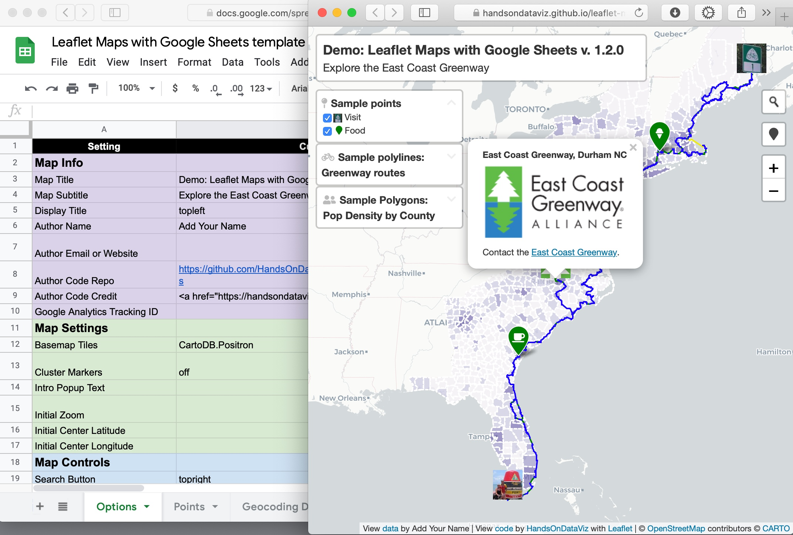

# Leaflet Maps with Google Sheets

Текущий проект основан на [данном проекте](https://github.com/HandsOnDataViz/leaflet-maps-with-google-sheets)

## Ссылки

- Leaflet Map https://dmitrypanteleeff.github.io/memory-map/
- Google Sheets https://docs.google.com/spreadsheets/d/1vmJUpZkeNctdvUPwxeL7gtMuundd184zR37m7BM5JP0/edit?gid=0#gid=0

#### Геокодирование адресов с помощью google-sheets

Для геокодирования использую скрипт, который добавил в Apps Script. Чтобы получить координаты точки, просто вносим адрес интересуемого объекта в ячейку
